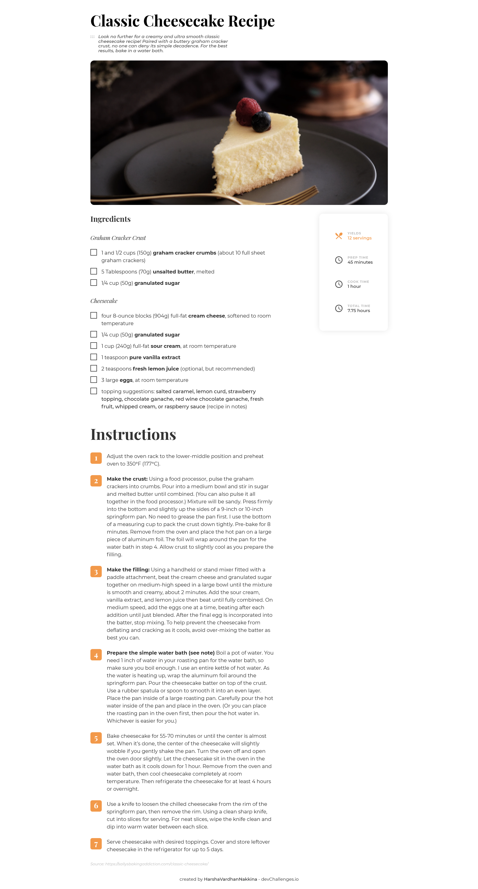

<!-- Please update value in the {}  -->

<h1 align="center">Recipe page challenge</h1>

<div align="center">
   Solution for a challenge from  <a href="http://devchallenges.io" target="_blank">Devchallenges.io</a>.
</div>

<div align="center">
  <h3>
    <a href="https://recipe-page-ten.vercel.app/">
      Demo
    </a>
    <span> | </span>
    <a href="https://devchallenges.io/solutions/qMqHohYkdzGcs3rzJnvn">
      Solution
    </a>
    <span> | </span>
    <a href="https://devchallenges.io/challenges/OEKdUZ6xs0h99C38XVht">
      Challenge
    </a>
  </h3>
</div>

<!-- OVERVIEW -->

## Overview



Introduce your projects by taking a screenshot or a gif. Try to tell visitors a story about your project by answering:

- Where can I see your demo?
  - [Here](https://recipe-page-ten.vercel.app/)
- What was your experience?
  - I learned media queries, css grid
- What have you learned/improved?
  - css grid, mobile-first design
- Your wisdom? :)
  - do mobile-first design

### Built With

<!-- This section should list any major frameworks that you built your project using. Here are a few examples.-->

- HTML5
- CSS3

## Features

<!-- List the features of your application or follow the template. Don't share the figma file here :) -->

This application/site was created as a submission to a [DevChallenges](https://devchallenges.io/challenges) challenge. The [challenge](https://devchallenges.io/challenges/OEKdUZ6xs0h99C38XVht) was to build an application to complete the following user stories:

- [x] User story: I can see a recipe with ingredients and instructions
- [x] User story: I can select a checkbox if I have the ingredients
- [x] User story: I can see the number of servings, baking times

## How To Use

To clone and run this application, you'll need [Git](https://git-scm.com) installed on your computer. From your command line:

```bash
# Clone this repository
$ git clone https://github.com/your-user-name/your-project-name

# open the index.html file in your browser
```

## Contact

- GitHub [@HarshaVardhanNakkina](https://github.com/HarshaVardhanNakkina)
- Twitter [@Ganeshh\_\_\_](https://twitter.com/Ganeshh___)
